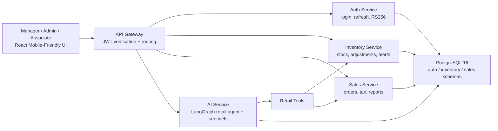
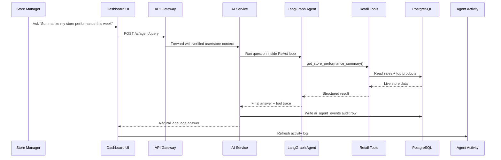
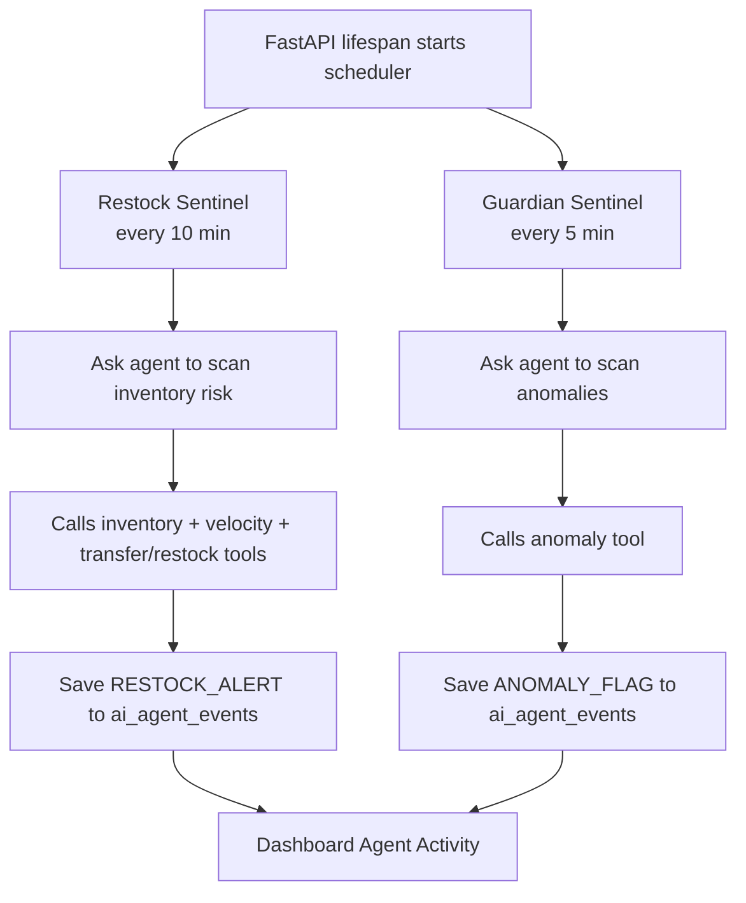

# NorthStar Outfitters
## Agentic Retail Operations Platform

**Submitted by:** Ratnala Sumith Kumar  
**Assessment:** Centific Premier Hackathon 2.0  
**Case Study:** Mobile-First Operations Platform for a Specialty Retail Chain  
**Stack:** Python + FastAPI + PostgreSQL + React + LangGraph + Gemini

**Live Demo:** [northstar-ops-sage.vercel.app](https://northstar-ops-sage.vercel.app/)  
**Source Code:** [github.com/sumithkumar123/northstar-ops](https://github.com/sumithkumar123/northstar-ops)

---

## 1. Executive Summary

NorthStar Outfitters operates 48 stores across two countries. A store manager needs one system that can:

- run checkout and billing safely
- keep inventory synchronized in near real time
- work on mobile and low-end devices
- surface anomalies, restock risks, and business insights quickly
- explain why the AI recommended an action

This submission delivers that as a microservices-based retail platform with an **agentic AI layer**, not just a database dashboard with a chat box attached.

The platform combines:

- **Transactional services** for auth, inventory, sales, and gateway routing
- **A retail agent** that chooses tools dynamically based on the question
- **Autonomous sentinels** that scan stores every 5-10 minutes
- **An audit trail** so managers can verify what the AI did, which tools it called, and whether the action was reasonable

The core value is simple: instead of making managers inspect five screens and connect the dots manually, the system can answer operational questions in plain English and show the tool trace behind the answer.

---

## 2. Evaluation Criteria Check

The case study asked for a mobile-first retail operations platform with microservices, secure auth, inventory and billing workflows, BI dashboards, and responsible agentic AI.

### Coverage Matrix

| Evaluation Criterion | Status | Notes |
|---|---|---|
| Clear microservices-based architecture | **Met** | Separate gateway, auth, inventory, sales, AI service, shared schema contracts, PostgreSQL schemas |
| Responsive mobile-compatible design | **Met** | React + Tailwind, tablet/mobile-friendly navigation, POS optimized for smaller screens |
| Secure auth and RBAC | **Met** | RS256 JWT, refresh tokens, role checks at gateway and service layer |
| Inventory, billing, stock monitoring, replenishment workflows | **Met** | Inventory service, POS checkout, low-stock alerts, replenishment recommendations |
| Transfer workflow | **Partially met** | Inventory transaction types support `transfer_in` / `transfer_out`; AI now recommends inter-store transfers, but a dedicated transfer execution UI is still phase 2 |
| BI dashboards and operational reporting | **Met** | Revenue trend, top products, inventory alerts, reports page, performance summaries |
| Agentic AI recommendations, anomaly detection, conversational querying | **Met** | LangGraph retail agent, anomaly checks, merchandising insights, natural-language querying |
| Python + PostgreSQL with sound APIs/data design | **Met** | FastAPI services, SQLAlchemy async, PostgreSQL schemas, clear REST routes |
| Performance and scalability considerations | **Met** | Async services, row locks for stock consistency, stateless AI service, deployment-ready containers |
| Security, reliability, observability, audit logging | **Met** | JWT, RBAC, health endpoints, audit table, deterministic low-level service boundaries |
| Intermittent connectivity and low-end devices | **Met** | Offline-safe POS with idempotent `offline_id`, lightweight mobile UI |
| Maintainability and future ERP/payment readiness | **Met** | Service boundaries, documented APIs, gateway pattern, external integration path clear |
| Compliance with AI-assisted development guardrails | **Met** | AI restricted to bounded tool use, manager-only access, auditable outputs, no uncontrolled SQL generation |

### Honest Gap

The main gap was that **transfer workflow** was previously implied but not demonstrated strongly enough in the product. To close that, this version adds a new agentic tool:

- `recommend_interstore_transfer`

This allows the agent to reason about whether a different store can temporarily cover a stock gap before recommending a fresh supplier order.

---

## 3. What We Built

### In Plain Terms

This project is a retail operations control room.

Without the AI, a store manager must:

1. open inventory
2. check low-stock items
3. open sales reports
4. estimate whether those items are actually moving fast
5. check if a suspicious transaction looks real
6. decide whether to reorder, transfer inventory, or ignore

With this system, the manager can ask:

> "What products need restocking before the weekend?"  
> "Can another store transfer stock to mine instead of ordering new units?"  
> "Summarize my store performance and top products this week."

The agent then:

1. decides what data it needs
2. calls the correct retail tools
3. reasons over the results
4. answers in manager language
5. logs the decision in `Agent Activity`

That is the difference between a normal DB project and an agentic retail operations platform.

---

## 4. Architecture Overview



### Why This Structure Matters

- **Gateway** keeps the client simple and centralizes auth enforcement
- **Inventory** and **Sales** remain deterministic transactional services
- **AI service** stays isolated, so agent logic can evolve without risking billing or stock integrity
- **PostgreSQL** uses separate schemas to preserve service boundaries while keeping the prototype deployable

---

## 5. Service Flow

### User-Initiated Agent Query



### Autonomous Agent Loops



This addresses the mentor feedback about “how the services flow” and “how they function using agentic AI” much more clearly than the original document did.

---

## 6. Why This Is Actually Agentic

Many projects say "AI" but only mean:

- a chatbot wrapped around static text
- a keyword router
- a hardcoded rule like `if stock < threshold then alert`

This project is different.

### Traditional Pattern

```python
def low_stock_report(store_id):
    return db.query("SELECT * FROM inventory WHERE quantity <= reorder_point")
```

That returns data, but it does not decide anything.

### Our Agentic Pattern

The retail agent uses LangGraph ReAct:

1. **Reason:** what data do I need first?
2. **Act:** call a retail tool
3. **Observe:** inspect the returned result
4. **Reason again:** do I need another tool?
5. **Finish:** synthesize a specific action for the manager

Example:

> "Should I reorder Trail Running Shoes before the weekend, or can another store transfer stock to me?"

The agent can decide to call:

1. `check_inventory_levels`
2. `analyze_sales_velocity`
3. `recommend_interstore_transfer`
4. `compute_restock_quantities`

It can then answer something like:

> "NYC will run short within 2 days. Boston has enough surplus to transfer 12 units immediately. After that, place a supplier order for 30 more units to cover the weekend and 14-day buffer."

That is useful because the AI is not just formatting data. It is selecting tools, chaining them, and deciding on the right operational response.

---

## 7. Agent Tooling

The current AI service exposes these retail tools:

| Tool | What It Does | Why It Matters |
|---|---|---|
| `check_inventory_levels` | Current stock + reorder status | Base signal for stock questions |
| `analyze_sales_velocity` | Units sold per day + days of stock left | Converts stock numbers into urgency |
| `detect_transaction_anomalies` | Finds suspicious orders with Z-score logic | Fraud / shrinkage signal |
| `get_seasonal_demand_forecast` | Highlights products relevant to current season | Merchandising support |
| `compute_restock_quantities` | Recommends purchase quantities | Actionable replenishment |
| `get_store_performance_summary` | Revenue, AOV, daily trends, top products | Manager performance view |
| `recommend_interstore_transfer` | Suggests donor stores with safe surplus | Stronger transfer workflow story |

### Why the New Transfer Tool Matters

This makes the project stronger against the rubric and the mentor feedback.

It shows that the AI is not only:

- answering from one table
- generating a summary

It is now also helping with a cross-service operational decision:

- destination store demand
- donor store surplus
- timing before stockout
- transfer-before-reorder recommendation

That is a more convincing example of agentic AI in a retail context.

---

## 8. How the User Can Verify the AI

One of the strongest product improvements is the **Agent Activity** panel.

It now acts like an AI work log.

Each activity row can show:

- **who acted**: Retail Agent / Restock Sentinel / Guardian Sentinel
- **what happened**: business summary or alert
- **which tools were used**
- **why it was logged**
- **severity**
- **time**

This matters for trust.

A manager can now see:

> "The agent answered my question by calling `get_store_performance_summary`"

and decide:

- yes, that was the correct tool
- or no, the agent should have also checked inventory / anomaly / transfer tools

So `Agent Activity` is not just decoration. It is an explainability and validation surface.

---

## 9. Screens and UX

### Dashboard


### Reports and AI


### POS


### UI Notes

The dashboard has been reworked to make the agent feel like the primary control surface:

- the agent command panel is now top-aligned and sticky on desktop
- the audit feed is visually separated as an explainability surface
- tool traces are visible in both the immediate response and the activity log
- the visual system now uses a more intentional command-center style instead of a generic admin template feel

This directly addresses the concern that the project should not look like a standard DB app with an AI widget bolted on.

---

## 10. Security, Reliability, and Auditability

### Security

- RS256 JWT auth
- refresh tokens
- role-based access for regional admins, store managers, sales associates
- gateway-enforced and service-enforced authorization

### Reliability

- health endpoints per service
- containerized deployment
- isolated transactional services for inventory and sales
- AI service failure does not break base retail workflows

### Auditability

- every agent event is stored in `ai_agent_events`
- managers can see the event summary, severity, time, and tool trace
- this keeps the AI explainable and reviewable

### Guardrails

- no open-ended agent access to mutate arbitrary DB state
- tool surface is bounded and explicit
- manager-only access to agent endpoints
- deterministic legacy endpoints remain available for fallback

---

## 11. Performance and Scalability Story

The case study asked for 1,200 concurrent users and seasonal spikes.

This prototype addresses that through design choices rather than synthetic benchmark claims:

- **FastAPI async services** keep I/O non-blocking
- **SQLAlchemy async + asyncpg** scale better under concurrent API load
- **`SELECT FOR UPDATE`** protects inventory consistency during concurrent checkout
- **Stateless AI service** can be scaled independently of auth/inventory/sales
- **Gateway pattern** keeps the client talking to a single public edge
- **Container-based deployment** keeps services independently deployable

### Practical Speed Story

- transactional reads are simple REST calls
- the agent usually answers in one to a few tool calls
- the audit trail gives immediate confirmation that the AI finished the workflow

The goal is not just “use AI.” The goal is “make AI fast enough and bounded enough to be operationally useful.”

---

## 12. Offline and Low-End Device Constraints

The case study explicitly mentioned intermittent connectivity and tablets/low-end Android devices.

This prototype addresses that by:

- keeping the client lightweight
- using role-focused screens instead of overloaded workflows
- supporting offline-safe order retries through `offline_id`
- building a compact POS layout suitable for floor staff

### Idempotent POS Retry Pattern

```python
if offline_id already exists:
    return existing_order
else:
    create_order()
```

That prevents double-posting when a shaky connection causes the same payment attempt to retry.

---

## 13. Deployment

### Local

```bash
docker compose up --build
docker compose exec auth_service python /scripts/seed.py
```

### Hosted Prototype

- **Frontend:** Vercel
- **Python services:** Railway
- **Database:** PostgreSQL

This satisfies the “deployable” expectation from the mentor feedback. The system is not just designed; it is actually running across a hosted frontend and backend.

---

## 14. Mentor Feedback Check

The earlier feedback was essentially:

> "The service structure is good, but it still sounds like a normal DB project. Show how it is agentic, how the services flow, how it works fast, and how it is deployable."

### What Has Now Been Addressed

| Feedback Theme | Current State |
|---|---|
| "Sounds like a normal DB project" | Improved: the dashboard foregrounds the agent, the document explains ReAct flow, and the tool trace is visible |
| "Agentic AI is not clear" | Improved: explicit tool-chaining examples, sentinels, activity audit, transfer advisor |
| "Architecture is not clear" | Improved: mermaid architecture + sequence flow |
| "How do services run?" | Improved: gateway/service/tool/database flow documented |
| "How fast/effective is it?" | Improved: async services, stateless AI, bounded tool calls, deployable hosted stack |
| "Deployable annav kada" | Met: Vercel + Railway deployment exists |

### Still Worth Improving Later

- full transfer execution UI instead of only AI recommendation + inventory transaction types
- richer observability such as OpenTelemetry traces
- live ERP and payment gateway integration
- richer regional admin cross-store orchestration dashboard

---

## 15. Final Positioning

This project is best described as:

> **A retail operations platform where microservices run the core business safely, and an agentic AI layer reasons across those services to help managers act faster.**

It stands out because:

- the AI is connected to real tools, not just a prompt box
- the agent can work proactively through scheduled sentinels
- users can verify the AI through tool traces and audit logs
- the product is deployable and structured for future expansion

If judged as a case-study prototype, it is strongest in:

- architecture
- RBAC/security
- operational dashboards
- replenishment/anomaly agent workflows
- explainable agent behavior

The main area still not fully production-complete is a dedicated **transfer execution workflow UI**, but the new inter-store transfer advisor makes that path explicit and materially strengthens the agentic retail story.

---

## 16. Appendix: Example Agent Trace

**Question**

> "Summarize my store performance and top products this week."

**Observed behavior**

- model receives manager question
- agent selects `get_store_performance_summary`
- tool reads paid orders and top products
- agent writes a concise summary
- `Agent Activity` stores the result with the tool trace

**Why this is important**

The user can now verify that the selected tool was appropriate. That makes the system easier to trust, debug, and demonstrate during evaluation.

---

*Prepared for the Centific NorthStar Outfitters case study assessment.*
